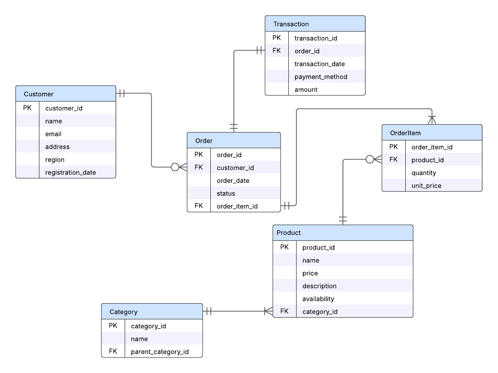
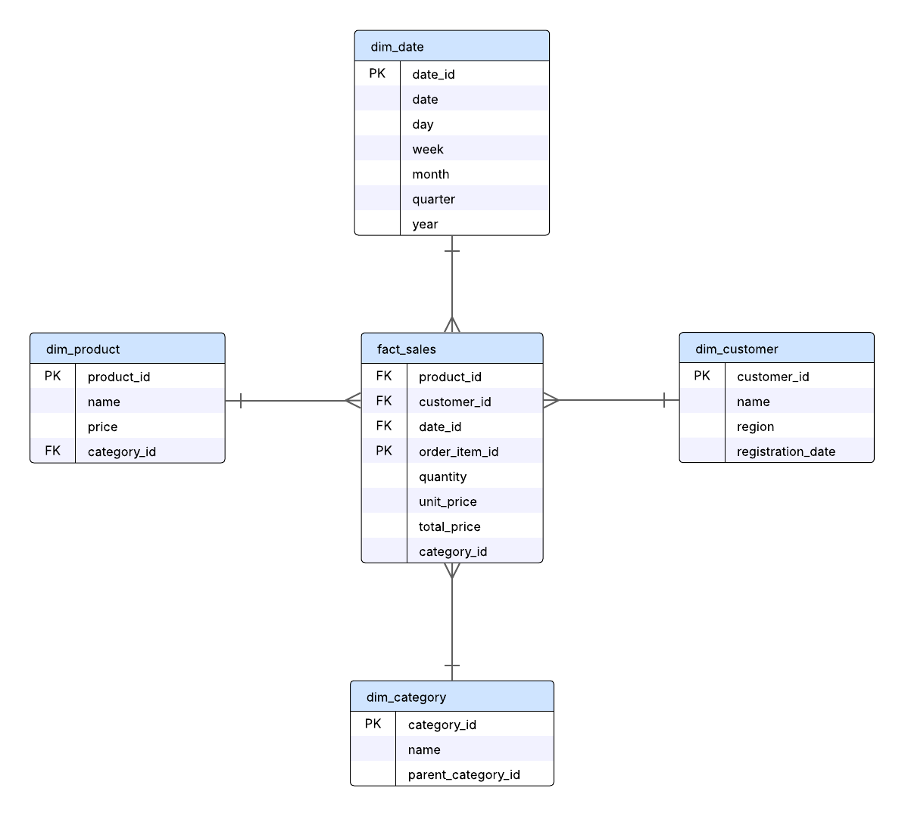

# Dátový model – e-commerce platforma

Tento priečinok obsahuje ER diagram, star scheme a SQL schému pre zadanie č. 1 (Data Engineer – GymBeam).

## ER Diagram
.

# Star schema – analytický model predaja

Tento model reprezentuje analytickú dátovú štruktúru určenú na analýzu predajov podľa rôznych dimenzií ako sú čas, produkt, kategória a región zákazníka.

## Prehľad schémy

- `fact_sales`: Hlavná faktová tabuľka obsahujúca transakčné údaje – množstvo, jednotková cena a celková suma.
- `dim_product`: Informácie o produktoch – názov, cena a kategória.
- `dim_category`: Hierarchia produktových kategórií (vrátane nadradených kategórií).
- `dim_customer`: Informácie o zákazníkoch a ich regióne.
- `dim_date`: Časová dimenzia pre analýzu podľa dní, mesiacov, kvartálov a rokov.

## Poznámka k denormalizácii

Pole `category_id` je zahrnuté priamo vo faktovej tabuľke `fact_sales` kvôli výkonnosti – aby nebolo potrebné spájať tabuľky `fact_sales → dim_product → dim_category` pri analytických dotazoch. Ide o zámernú denormalizáciu.

## Diagram

##  Kľúče, normalizácia a denormalizácia

### a. Primárne a cudzie kľúče

#### V ER diagrame:
- **Primárne kľúče (PK):**
  - `customer_id`, `product_id`, `order_id`, `order_item_id`, `transaction_id`, `category_id`

- **Cudzie kľúče (FK):**
  - `Order.customer_id → Customer.customer_id`
  - `OrderItem.order_id → Order.order_id`
  - `OrderItem.product_id → Product.product_id`
  - `Product.category_id → Category.category_id`
  - `Transaction.order_id → Order.order_id`

#### V star schema modeli:
- `fact_sales.product_id → dim_product.product_id`
- `fact_sales.customer_id → dim_customer.customer_id`
- `fact_sales.date_id → dim_date.date_id`
- `fact_sales.category_id → dim_category.category_id` *(denormalizované FK pre výkon)*

---

### b. Normalizačné kroky a úrovne normalizácie

#### ER model:
- **1NF:** všetky stĺpce obsahujú atómové (nedeliteľné) hodnoty.
- **2NF:** všetky atribúty sú plne závislé od celého primárneho kľúča.
- **3NF:** žiadne tranzitívne závislosti – napr. kategória nie je priamo v tabuľke produktov.

#### Star schema:
- Dimenzie sú mierne denormalizované, aby boli jednoduchšie na použitie v BI nástrojoch.
- Zámerne sa nepoužíva hlboká normalizácia, aby sa minimalizovali joiny.

---

### c. Denormalizácia pre výkon

- V `fact_sales` sa nachádza `category_id`, hoci je dostupné aj cez `dim_product`.  
  ➝ Ide o zámernú denormalizáciu kvôli rýchlejším agregáciám podľa kategórie.

- Voliteľne by sa dali denormalizovať aj ďalšie často dotazované údaje, napr.:
  - `region` zo `dim_customer`
  - `year`, `month` z `dim_date` (kvôli rýchlemu filtrovania podľa času)

 ## SQL schéma

Kompletný SQL skript na vytvorenie databázy (operačný aj analytický model) nájdete tu:

 [create_schema.sql](./create_schema.sql)

